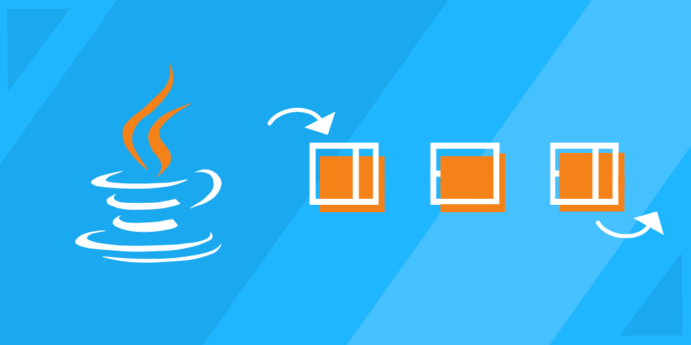

# Class 9

#  **Stacks and Queues** 
 
* ## Stacks 
A stack is a collection that is based on the last-in-first-out (LIFO) policy. By tradition, we name the stack insert method `push()` and the stack remove operation `pop()`. 
In programming, a stack is an abstract, linear data type with a predefined capacity (or boundary). It follows a particular order for adding or removing elements. Linear data structures organize their components in a straight line, so if we we add or remove an element, they will grow or shrink respectively. 
The implementation of stacks is relatively easy. The functionality depends on the `pop` and `push` method, as you can see from the illustration above. The pop method removes or deletes elements from the stack, while the push method adds items to the stack. 
When an element is inserted into a stack, it takes the top position and the variable storing this position points to the number below it. The top variable should be updated anytime an element is inserted or removed from it. 

---
* ## Queues 
### **What is a Queue?**
A queue is a lot like a stack. A Queue is also a linear structure that follows a First In First Out (FIFO) order, but they differ in how elements are removed. Queues are open from both ends: one end for inserting data `(enqueue)`, and the other end for removing data `(dequeue)`. A stack is only open from one end. 
When it comes to queues, think of a check out counter at your favorite grocery store. The first person in the checkout line will be attended to first before others, and the last person in line will be attend to last. This is how a queue works. It has two ends, front and rear. Elements enter from the rear and leave from the front. 

---