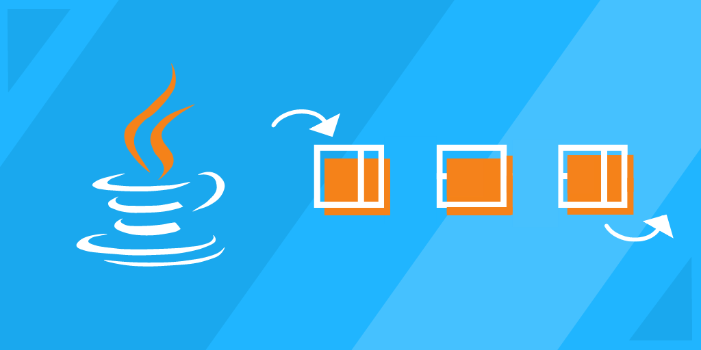

# Class 10

#  **Spring** 
<!--   -->
* ## Spring App Basics 
The Spring Framework provides a comprehensive programming and configuration model for modern Java-based enterprise applications - on any kind of deployment platform. 
A key element of Spring is infrastructural support at the application level: Spring focuses on the "plumbing" of enterprise applications so that teams can focus on application-level business logic, without unnecessary ties to specific deployment environments. 
Spring is a lightweight framework. It can be thought of as a framework of frameworks because it provides support to various frameworks such as Struts, Hibernate, Tapestry, EJB, JSF, etc. The framework, in broader sense, can be defined as a structure where we find solution of the various technical problems. 
The Spring framework comprises several modules such as IOC, AOP, DAO, Context, ORM, WEB MVC etc. We will learn these modules in next page. Let's understand the IOC and Dependency Injection first. 

### Advantages of Spring Framework 
There are many advantages of Spring Framework. They are as follows:

1) Predefined Templates 
Spring framework provides templates for JDBC, Hibernate, JPA etc. technologies. So there is no need to write too much code. It hides the basic steps of these technologies. 
Let's take the example of JdbcTemplate, you don't need to write the code for exception handling, creating connection, creating statement, committing transaction, closing connection etc. You need to write the code of executing query only. Thus, it save a lot of JDBC code.

2) Loose Coupling 
The Spring applications are loosely coupled because of dependency injection.

3) Easy to test 
The Dependency Injection makes easier to test the application. The EJB or Struts application require server to run the application but Spring framework doesn't require server.

4) Lightweight 
Spring framework is lightweight because of its POJO implementation. The Spring Framework doesn't force the programmer to inherit any class or implement any interface. That is why it is said non-invasive.

5) Fast Development 
The Dependency Injection feature of Spring Framework and it support to various frameworks makes the easy development of JavaEE application.

6) Powerful abstraction 
It provides powerful abstraction to JavaEE specifications such as JMS, JDBC, JPA and JTA.

7) Declarative support 
It provides declarative support for caching, validation, transactions and formatting.

---
* ## Spring MVC and Thymeleaf 
Spring MVC calls the pieces of data that can be accessed during the execution of views model attributes. The equivalent term in Thymeleaf language is context variables. 
`<dependency>`
   ` <groupId>org.springframework.boot</groupId>`
   ` <artifactId>spring-boot-starter-thymeleaf</artifactId>`
   ` <version>2.4.0</version>`
`</dependency>`
---