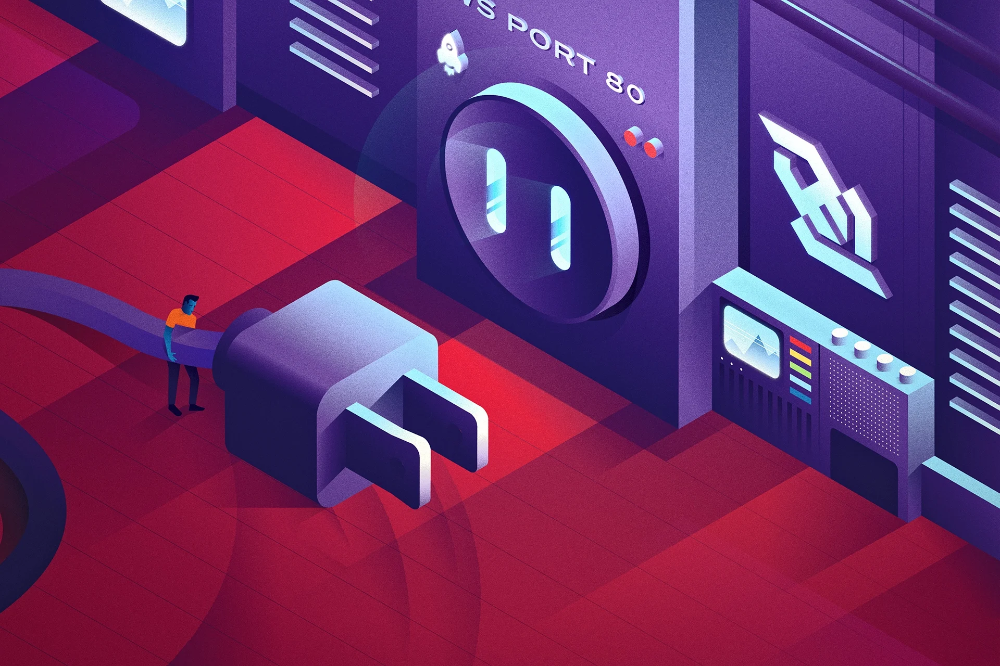

# Read 19

* ## Real time messaging with websockets  
### What is WebSocket? 
The web has traveled a long way to support full-duplex (or two-way) communication between a client and server. This is the prime intention of the WebSocket protocol: to provide persistent real-time communication between the client and the server over a single TCP socket connection. 
The WebSocket protocol has only two agendas : 1.) to open up a handshake, and 2.) to help the data transfer. Once the server and client both have their handshakes in, they can send data to each other with less overhead at will. 
WebSocket communication takes place over a single TCP socket using either WS (port 80) or WSS (port 443) protocol. Almost every browser except Opera Mini provides admirable support for WebSockets at the time of writing, as per Can I Use. 
### How is WebSocket different than HTTP polling, HTTP streaming, and server-sent events? 
Historically, creating web apps that needed real-time data (like gaming or chat apps) required an abuse of HTTP protocol to establish bidirectional data transfer. There were multiple methods used to achieve real-time capabilities, but none of them were as efficient as WebSockets. HTTP polling, HTTP streaming, Comet, SSE — they all had their own drawbacks. 

---
