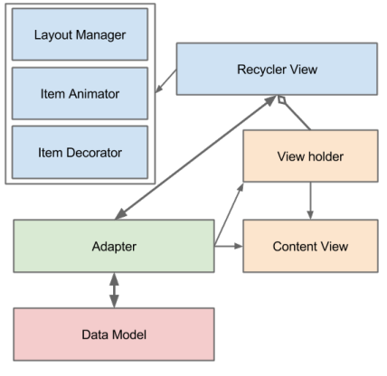

# Read 28

* ## RecyclerView for displaying lists of data 
RecyclerView makes it easy to efficiently display large sets of data. You supply the data and define how each item looks, and the RecyclerView library dynamically creates the elements when they're needed. 
As the name implies, RecyclerView recycles those individual elements. When an item scrolls off the screen, RecyclerView doesn't destroy its view. Instead, RecyclerView reuses the view for new items that have scrolled onscreen. This reuse vastly improves performance, improving your app's responsiveness and reducing power consumption. 
Recycling  is very important as waste has a huge negative impact on the natural environment. Same as real world in computer programming world recycling a memory is very important. Programmer dynamically allocates memory to program, when requested, and free it up for reuse when it is no longer needed. In a same way Recycling play a huge role in Android world. For Displaying scrollable list of items Google introduced Listview with Android SDK API 1. But with complex list of data Listview not provide good performance as it not reuse cell (Recycle) while scrolling up/down (We can achieve this using Viewholder concept in Listview). Recyclerview is introduced in API 21(Lollipop) to overcome all this problems which we face in Listview. Recyclerview is game changer for android developer. Recyclerview is advance and improved version of Listview. Today we are going to discuss about Recyclerview in Android. 
### Recyclerview Architecture 

---
